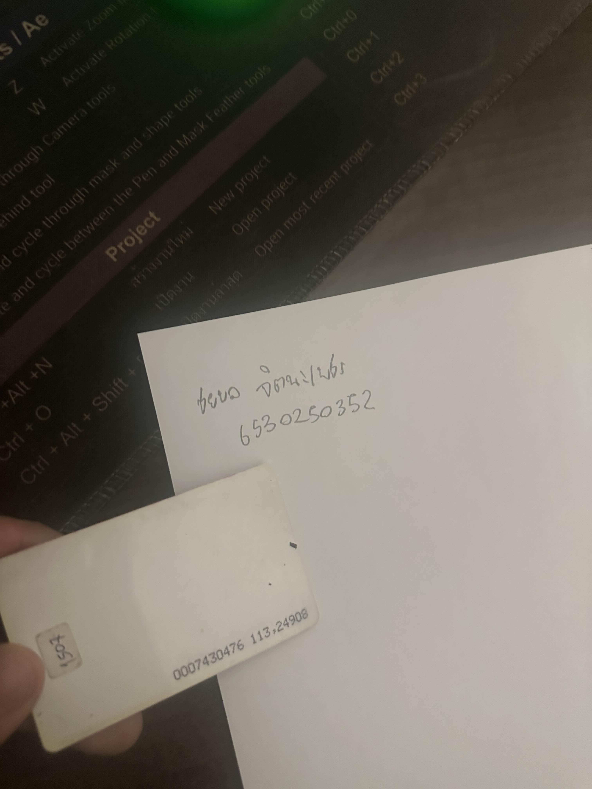

## 🔑 คีย์การ์ด (Keycard) 🔑  

### 🛠️ Control Function  
**⛔ Preventive Control**  
– ป้องกันการเข้าถึงโดยไม่ได้รับอนุญาต โดยกำหนดสิทธิ์ให้เฉพาะผู้ที่มีบัตรเท่านั้นสามารถเข้าไปยังพื้นที่ที่กำหนดได้  

### 🏛️ Types of Security Control  
- **🛡️ Physical Control** – ควบคุมการเข้าถึงสถานที่จริง เช่น อาคาร หอพัก หรือห้องที่ต้องการความปลอดภัย

---  

📍 **สถานที่** : หอพัก The room  
🏠 **ที่อยู่** : ตำบลทุ่งสุขลา อำเภอศรีราชา ชลบุรี 20230  

---  

## 📌 สรุป  
คีย์การ์ดเป็นระบบ **Preventive Control** ที่ช่วยป้องกันไม่ให้บุคคลที่ไม่ได้รับอนุญาตเข้าถึงพื้นที่ โดยต้องใช้บัตรที่ได้รับสิทธิ์ในการเปิดประตู จัดอยู่ในประเภท **Physical Control** ซึ่งช่วยเพิ่มความปลอดภัยของทรัพย์สินและผู้อยู่อาศัยในพื้นที่  
